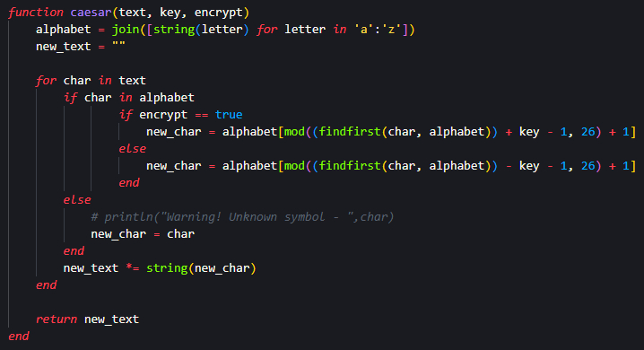
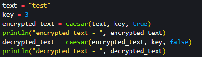
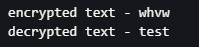
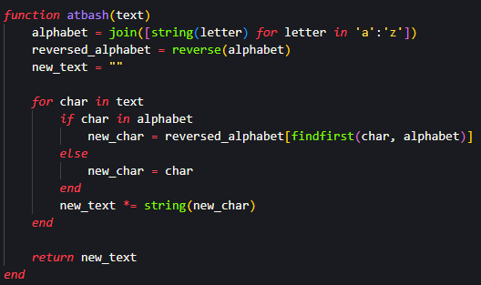
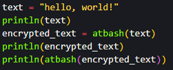
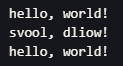

## Цель работы

Ознакомление с шифрами простой замены. Программная реализация шифров Цезаря и Атбаш  на языке программирования Julia.

## Задания

- Создать алгоритм шифрования Цезаря

- Создать алгоритм шифрования Атбаш

# Шифр Цезаря 

## Шифр Цезаря - код

{#fig:001 width=50%}

{#fig:002 width=50%}

## Шифр Цезаря - результат 

{#fig:003}

# Шифр Атбаш

## Шифр Атбаш - код

{#fig:004 width=50%}

{#fig:005 width=50%}

## Шифр Цезаря - результат 

{#fig:006}

## Вывод

Я ознакомился с шифрами простой замены и создал алгоритмы шифров Цезаря и Атбаш на языке программирования Julia.

# Спасибо за внимание