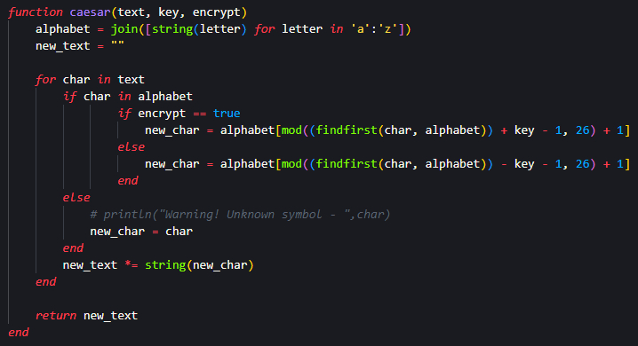
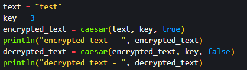
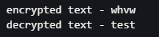
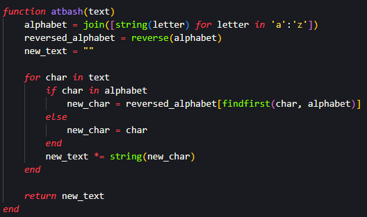
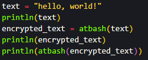
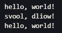

---
## Front matter
title: "Лабораторна работа №1"
subtitle: "Шифры простой замены"
author: "Покрас Илья Михайлович"

## Generic otions
lang: ru-RU
toc-title: "Содержание"

## Bibliography
bibliography: bib/cite.bib
csl: pandoc/csl/gost-r-7-0-5-2008-numeric.csl

## Pdf output format
toc: true # Table of contents
toc-depth: 2
lof: true # List of figures
lot: false # List of tables
fontsize: 12pt
linestretch: 1.5
papersize: a4
documentclass: scrreprt
## I18n polyglossia
polyglossia-lang:
  name: russian
  options:
	- spelling=modern
	- babelshorthands=true
polyglossia-otherlangs:
  name: english
## I18n babel
babel-lang: russian
babel-otherlangs: english
## Fonts
mainfont: IBM Plex Serif
romanfont: IBM Plex Serif
sansfont: IBM Plex Sans
monofont: IBM Plex Mono
mathfont: STIX Two Math
mainfontoptions: Ligatures=Common,Ligatures=TeX,Scale=0.94
romanfontoptions: Ligatures=Common,Ligatures=TeX,Scale=0.94
sansfontoptions: Ligatures=Common,Ligatures=TeX,Scale=MatchLowercase,Scale=0.94
monofontoptions: Scale=MatchLowercase,Scale=0.94,FakeStretch=0.9
mathfontoptions:
## Biblatex
biblatex: true
biblio-style: "gost-numeric"
biblatexoptions:
  - parentracker=true
  - backend=biber
  - hyperref=auto
  - language=auto
  - autolang=other*
  - citestyle=gost-numeric
## Pandoc-crossref LaTeX customization
figureTitle: "Рис."
lofTitle: "Список иллюстраций"
## Misc options
indent: true
header-includes:
  - \usepackage{indentfirst}
  - \usepackage{float} # keep figures where there are in the text
  - \floatplacement{figure}{H} # keep figures where there are in the text
---

# Цель работы

Ознакомиться с шифрами простой замены. Создать программную реализацию шифров Цезаря и Атбаш.

# Задание

- Создать алгоритм шифрования Цезаря

- Создать алгоритм шифрования Атбаш

# Теоретическое введение

- Шифр Цезаря — это один из самых простых и древних методов шифрования. Он заключается в замене каждой буквы исходного текста на другую букву, находящуюся на фиксированное число позиций вперед или назад в алфавите. Он получил своё название в честь Гая Юлия Цезаря, римского полководца и диктатора, который использовал этот метод для шифрования военной корреспонденции. Цезарь применял сдвиг на 3 буквы для шифрования сообщений, чтобы сделать их непонятными для противников. Этот метод использовался около 58 года до н.э. Во времена Цезаря шифр был достаточно эффективным, так как многие противники не знали принципа его работы. Однако сегодня шифр Цезаря считается очень слабым с точки зрения криптографии, поскольку количество возможных ключей ограничено.

- Шифр Атбаш — это моноалфавитный шифр замены, в котором буквы алфавита заменяются на свои зеркальные эквиваленты. Принцип работы основан на том, что первая буква алфавита заменяется на последнюю, вторая — на предпоследнюю и так далее. Это делает шифр симметричным: процесс шифрования и расшифрования одинаков.

# Выполнение лабораторной работы

## Шифр Цезаря

Я создал функцию шифра Цезаря с входными данными: исходным текстом, ключом шифрования и типом операции( true - шифрование и false - дешифрование). Данная функция возвращает зашифрованный текст (рис. [-@fig:001]).

{#fig:001}

Далее я инициализировал переменную, которая содержит исходный текст и ключ шифрования, после чего с использую эти данные в вызове функции цезаря. Далее полученный результат записываю в новую переменную, которая будет использована как входной параметр для дешифрования. (рис. [-@fig:002]).

{#fig:002}

И получил следующий результат (рис. [-@fig:003]).

{#fig:003}

## Шифр Атбаш

Я создал функцию шифра Цезаря с входными данными: исходным текстом, ключом шифрования и типом операции( true - шифрование и false - дешифрование). Данная функция возвращает зашифрованный текст (рис. [-@fig:004]).

{#fig:004}

Далее я инициализировал переменную, которая содержит исходный текст и ключ шифрования, после чего с использую эти данные в вызове функции цезаря. Далее полученный результат записываю в новую переменную, которая будет использована как входной параметр для дешифрования. (рис. [-@fig:005]).

{#fig:005}

И получил следующий результат (рис. [-@fig:006]).

{#fig:006}

# Выводы

Я ознакомился с шифрами простой замены и создал программную реализацию шифров Цезаря и Атбаш.

# Список Литературы{.unnumbered}

1. [Julia - Control Flow](https://docs.julialang.org/en/v1/manual/control-flow/)
2. [Julia - Mathematical Operations](https://docs.julialang.org/en/v1/manual/mathematical-operations/)
3. [Julia - Mathematical Operations](https://docs.julialang.org/en/v1/manual/strings/)
4. [Julia - Arrays](https://docs.julialang.org/en/v1/base/arrays/)
5. [Julia - Math](https://docs.julialang.org/en/v1/base/math/)
