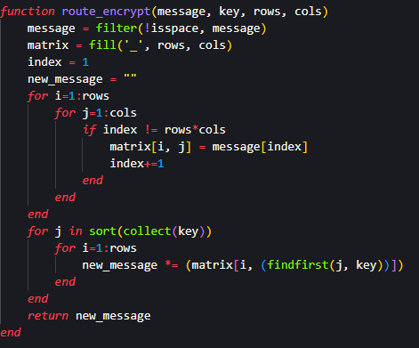
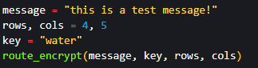
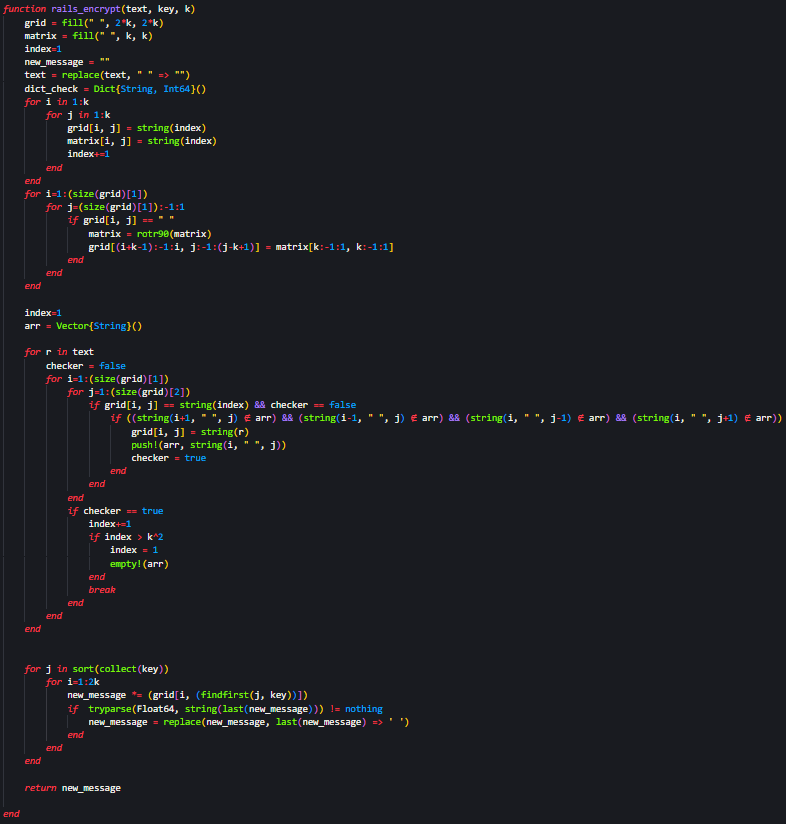
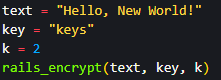
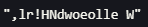
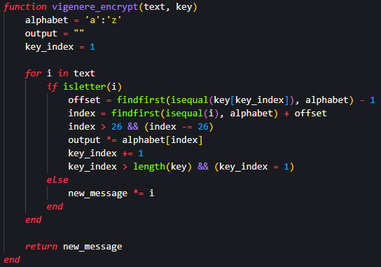
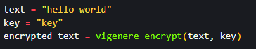

## Цель работы

Ознакомиться с шифрами перестановки и реализовать программный код маршрутного шифрования, шифрования решеток и шифрования Виженера.

## Задания

- Создать алгоритм маршрутного шифрования 

- Создать алгоритм шифрования с помощью решеток

- Создать алгоритм шифрования Виженера

# Маршрутное шифрование

## Маршрутное шифрование - код

{#fig:001 width=55%}

{#fig:002  width=50%}

## Маршрутное шифрование - результат 

{#fig:003}

# Шифрование с помощью решеток

## Шифрование с помощью решеток - код

{#fig:004 width=35%}

{#fig:005}

## Шифрование с помощью решеток - результат 

{#fig:006}

# Шифрование Виженера

## Шифрование Виженера - код

{#fig:007  width=55%}

{#fig:008  width=75%}

## Шифрование Виженера - результат

{#fig:009}

## Вывод

Я ознакомился с шифрами перестановки и реализовал программный код маршрутного шифрования, шифрования решеток и шифрования Виженера.

# Спасибо за внимание