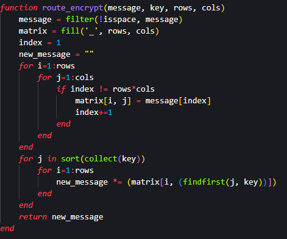
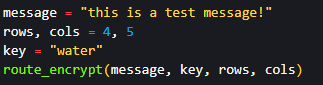
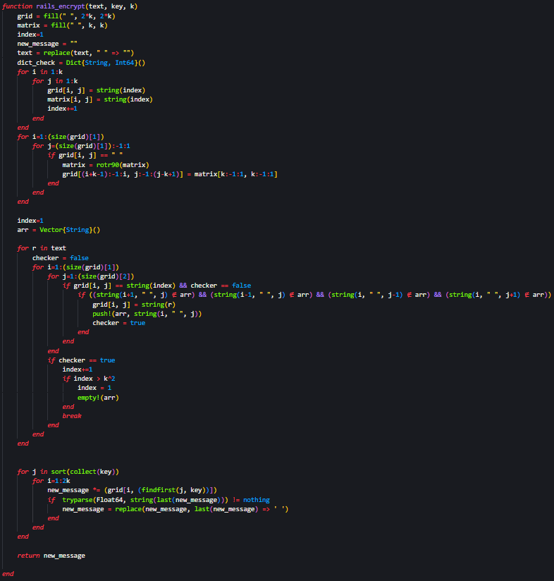
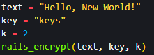
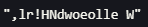
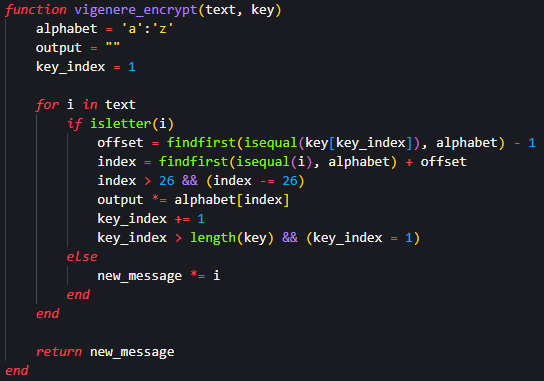
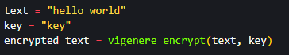
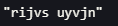

---
## Front matter
title: "Лабораторна работа №2"
subtitle: "Шифры перестановки"
author: "Покрас Илья Михайлович"

## Generic otions
lang: ru-RU
toc-title: "Содержание"

## Bibliography
bibliography: bib/cite.bib
csl: pandoc/csl/gost-r-7-0-5-2008-numeric.csl

## Pdf output format
toc: true # Table of contents
toc-depth: 2
lof: true # List of figures
lot: false # List of tables
fontsize: 12pt
linestretch: 1.5
papersize: a4
documentclass: scrreprt
## I18n polyglossia
polyglossia-lang:
  name: russian
  options:
	- spelling=modern
	- babelshorthands=true
polyglossia-otherlangs:
  name: english
## I18n babel
babel-lang: russian
babel-otherlangs: english
## Fonts
mainfont: IBM Plex Serif
romanfont: IBM Plex Serif
sansfont: IBM Plex Sans
monofont: IBM Plex Mono
mathfont: STIX Two Math
mainfontoptions: Ligatures=Common,Ligatures=TeX,Scale=0.94
romanfontoptions: Ligatures=Common,Ligatures=TeX,Scale=0.94
sansfontoptions: Ligatures=Common,Ligatures=TeX,Scale=MatchLowercase,Scale=0.94
monofontoptions: Scale=MatchLowercase,Scale=0.94,FakeStretch=0.9
mathfontoptions:
## Biblatex
biblatex: true
biblio-style: "gost-numeric"
biblatexoptions:
  - parentracker=true
  - backend=biber
  - hyperref=auto
  - language=auto
  - autolang=other*
  - citestyle=gost-numeric
## Pandoc-crossref LaTeX customization
figureTitle: "Рис."
lofTitle: "Список иллюстраций"
## Misc options
indent: true
header-includes:
  - \usepackage{indentfirst}
  - \usepackage{float} # keep figures where there are in the text
  - \floatplacement{figure}{H} # keep figures where there are in the text
---

# Цель работы

Ознакомиться с шифрами перестановки и реализовать программный код маршрутного шифрования, шифрования решеток и шифрования Виженера.

# Задание

- Создать алгоритм маршрутного шифрования 

- Создать алгоритм шифрования с помощью решеток

- Создать алгоритм шифрования Виженера

# Теоретическое введение

- Маршрутное шифрование - это метод шифрования, при котором символы сообщения переставляются или перестраиваются в соответствии с определенным правилом. Каждый символ сообщения заменяется другим символом или перемещается на определенное количество позиций в алфавите.

- Шифрование с помощью решеток - это метод шифрования, при котором сообщение записывается в ячейки решетки, а затем символы выбираются в определенном порядке для формирования зашифрованного текста. Расшифровка происходит путем восстановления исходного текста из решетки.

- Шифрование Виженера - это метод шифрования, основанный на использовании повторяющегося ключа. Каждая буква ключа соответствует определенной букве алфавита, и при шифровании каждая буква сообщения сдвигается на соответствующее значение ключа. Для расшифровки используется обратная операция сдвига.

# Выполнение лабораторной работы

## Маршрутное шифрования

Я создал функцию маршрутного шифрования с входными данными: исходным текстом, ключом шифрования и параметрами матрицы - количество строк и столбцов. Данная функция возвращает зашифрованный текст (рис. [-@fig:001]).

{#fig:001}

Далее я инициализировал переменные, которые содержат исходный текст, ключ шифрования и данные матрицы(строки, столбцы), после чего использовал эти данные в вызове функции маршутного шифрования. (рис. [-@fig:002]).

{#fig:002}

И получил следующий результат (рис. [-@fig:003]).

{#fig:003}

## Шифрование с помощью решеток

Я создал функцию шифрования с помощью решеток принимающую исходный текст, натуральное число k и ключ шифрования, которая создает матрицу c элементами, принимающие значения от 1 до k^2. Далее c помощью циклов я заменил эти числовые значения на символы, содержащиеся в сообщении(кроме пробелов - они удаляются). Далее с помощью ключа я составил новый зашифрованный текст, заменяя те числовые значения, которые остались, на пробелы (рис. [-@fig:004]).

{#fig:004}

Далее я инициализировал переменные, которые содержат исходный текст, натуральное число и ключ шифрования, после чего использовал эти данные в вызове функции шифрования решеток. (рис. [-@fig:005]).

{#fig:005}

И получил следующий результат (рис. [-@fig:006]).

{#fig:006}

## Шифрование Виженера

Я создал функцию шифрования Виженера, которая принимает текст и ключ шифрования, и возвращает зашифрованный текст (рис. [-@fig:007]).

{#fig:007}

Далее я инициализировал переменные, которые содержат исходный текст, ключ шифрования, после чего использовал эти данные в вызове функции шифрования Виженера. (рис. [-@fig:008]).

{#fig:008}

И получил следующий результат (рис. [-@fig:009]).

{#fig:009}

# Выводы

Я ознакомился с шифрами перестановки и реализовал программный код маршрутного шифрования, шифрования решеток и шифрования Виженера.

# Список Литературы{.unnumbered}

1. [Julia - Control Flow](https://docs.julialang.org/en/v1/manual/control-flow/)
2. [Julia - Mathematical Operations](https://docs.julialang.org/en/v1/manual/mathematical-operations/)
3. [Julia - Strings](https://docs.julialang.org/en/v1/manual/strings/)
4. [Julia - Arrays](https://docs.julialang.org/en/v1/base/arrays/)
5. [Julia - Collections and Data Structures](https://docs.julialang.org/en/v1/base/collections/)
