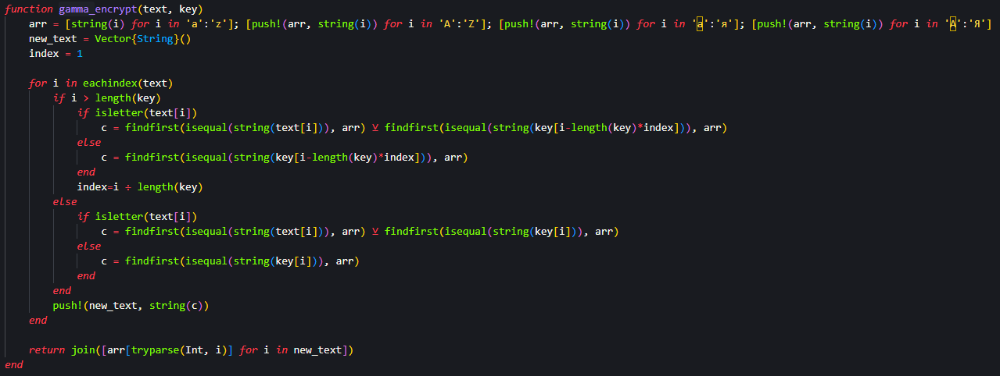
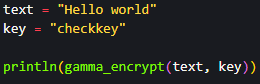

## Цель работы

Изучить и реализовать алгоритм шифрования гаммированием конечной гаммой.

## Задания

- Создать алгоритм шифрования гаммированием

## Шифрование Гаммированием - код 

{#fig:001}

{#fig:002}

## Шифрование Гаммированием - результат

{#fig:003}

## Вывод

Я изучил и реализовал алгоритм шифрования гаммированием конечной гаммой.

# Спасибо за внимание