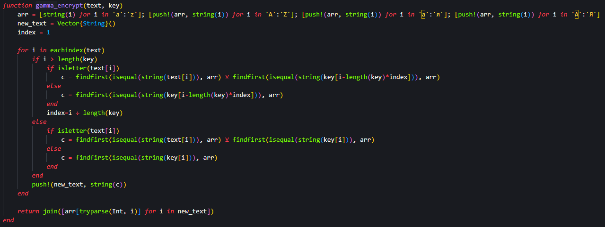
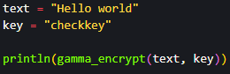

---
## Front matter
title: "Лабораторна работа № 3"
subtitle: "Шифрование Гаммированием"
author: "Покрас Илья Михайлович"

## Generic otions
lang: ru-RU
toc-title: "Содержание"

## Bibliography
bibliography: bib/cite.bib
csl: pandoc/csl/gost-r-7-0-5-2008-numeric.csl

## Pdf output format
toc: true # Table of contents
toc-depth: 2
lof: true # List of figures
lot: false # List of tables
fontsize: 12pt
linestretch: 1.5
papersize: a4
documentclass: scrreprt
## I18n polyglossia
polyglossia-lang:
  name: russian
  options:
	- spelling=modern
	- babelshorthands=true
polyglossia-otherlangs:
  name: english
## I18n babel
babel-lang: russian
babel-otherlangs: english
## Fonts
mainfont: IBM Plex Serif
romanfont: IBM Plex Serif
sansfont: IBM Plex Sans
monofont: IBM Plex Mono
mathfont: STIX Two Math
mainfontoptions: Ligatures=Common,Ligatures=TeX,Scale=0.94
romanfontoptions: Ligatures=Common,Ligatures=TeX,Scale=0.94
sansfontoptions: Ligatures=Common,Ligatures=TeX,Scale=MatchLowercase,Scale=0.94
monofontoptions: Scale=MatchLowercase,Scale=0.94,FakeStretch=0.9
mathfontoptions:
## Biblatex
biblatex: true
biblio-style: "gost-numeric"
biblatexoptions:
  - parentracker=true
  - backend=biber
  - hyperref=auto
  - language=auto
  - autolang=other*
  - citestyle=gost-numeric
## Pandoc-crossref LaTeX customization
figureTitle: "Рис."
lofTitle: "Список иллюстраций"
## Misc options
indent: true
header-includes:
  - \usepackage{indentfirst}
  - \usepackage{float} # keep figures where there are in the text
  - \floatplacement{figure}{H} # keep figures where there are in the text
---

# Цель работы

Изучить и реализовать алгоритм шифрования гаммированием конечной гаммой.

# Задание

- Создать алгоритм шифрования гаммированием

# Теоретическое введение

Шифрование гаммированием — это симметричный метод шифрования, при котором на открытый текст накладывается последовательность, сформированная из случайных чисел.

Процесс шифрования:

- Генерируется ключевой поток гаммы из непредсказуемых и независимых друг от друга случайных чисел.
- Каждый символ сообщения комбинируется с символом ключевого потока гаммы с помощью операции XOR (исключающее ИЛИ).

# Выполнение лабораторной работы

Я создал функцию шифрования гаммированием, с текстом и ключом шифрования. Далее создается алфавит, содержащий строчные и заглавные буквы английского и русского алфавитов, и создается массив для зашифрованного текста. После идет функция расчета позиций букв в алфавите с использованием XOR и записываются в массив, который будет возвращаться как строковое значение с конвертированными позициями алфавита непосредственно в буквы (рис. [-@fig:001]).

{#fig:001}

Далее я инициализировал переменные, которые содержат исходный текст и ключ шифрования, после чего использовал эти данные в вызове функции шифрования решеток (рис. [-@fig:002]).

{#fig:002}

И получил следующий результат  (рис. [-@fig:003]):

{#fig:003}

# Выводы

Я изучил и реализовал алгоритм шифрования гаммированием конечной гаммой.

# Список Литературы{.unnumbered}

1. [Julia - Control Flow](https://docs.julialang.org/en/v1/manual/control-flow/)
2. [Julia - Mathematical Operations](https://docs.julialang.org/en/v1/manual/mathematical-operations/)
3. [Julia - Strings](https://docs.julialang.org/en/v1/manual/strings/)
4. [Julia - Arrays](https://docs.julialang.org/en/v1/base/arrays/)
5. [Julia - Collections and Data Structures](https://docs.julialang.org/en/v1/base/collections/)