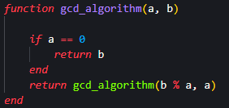
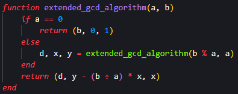
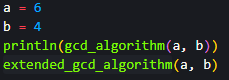
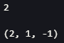
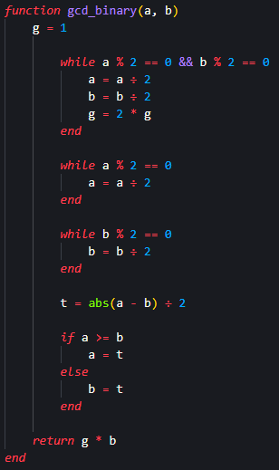
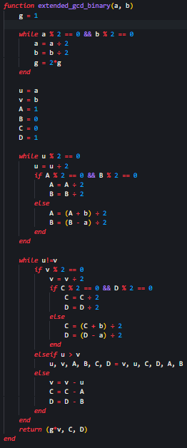
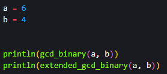

## Цель работы

Реализовать алгоритмы нахождения наибольшего общего делителя (НОД)

## Задания

- Реализовать алгоритм Евклида;

- Реализовать расширенный алгоритм Евклида;

- Реализовать бинарный алгоритм Евклида;

- Реализовать бинарный расширенный алгоритм Евклида;

## Алгоритм Евклида

{#fig:001}

## Расширенный алогритм Евклида

{#fig:002}

## Инициализация и вызов функций алгоритмов

{#fig:003}

{#fig:004}

## Бинарный алогритм Евклида

{#fig:005 width=40%}

## Расширенный бинарный алогритм Евклида

{#fig:006 width=30%}

## Инициализация и вызов функций алгоритмов

{#fig:007}

{#fig:008}

## Вывод

Я реализовал алгоритмы нахождения НОД.

# Спасибо за внимание