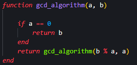
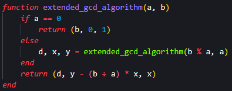
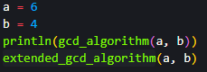
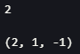
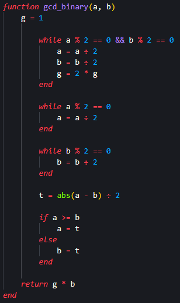
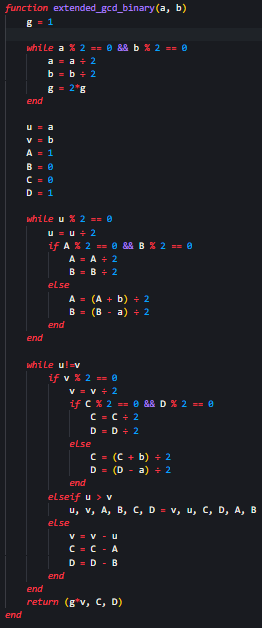
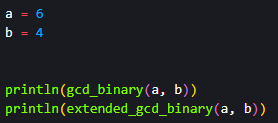

---
## Front matter
title: "Лабораторна работа № 4"
subtitle: "Вычисление наибольшего общего делителя"
author: "Покрас Илья Михайлович"

## Generic otions
lang: ru-RU
toc-title: "Содержание"

## Bibliography
bibliography: bib/cite.bib
csl: pandoc/csl/gost-r-7-0-5-2008-numeric.csl

## Pdf output format
toc: true # Table of contents
toc-depth: 2
lof: true # List of figures
lot: false # List of tables
fontsize: 12pt
linestretch: 1.5
papersize: a4
documentclass: scrreprt
## I18n polyglossia
polyglossia-lang:
  name: russian
  options:
	- spelling=modern
	- babelshorthands=true
polyglossia-otherlangs:
  name: english
## I18n babel
babel-lang: russian
babel-otherlangs: english
## Fonts
mainfont: IBM Plex Serif
romanfont: IBM Plex Serif
sansfont: IBM Plex Sans
monofont: IBM Plex Mono
mathfont: STIX Two Math
mainfontoptions: Ligatures=Common,Ligatures=TeX,Scale=0.94
romanfontoptions: Ligatures=Common,Ligatures=TeX,Scale=0.94
sansfontoptions: Ligatures=Common,Ligatures=TeX,Scale=MatchLowercase,Scale=0.94
monofontoptions: Scale=MatchLowercase,Scale=0.94,FakeStretch=0.9
mathfontoptions:
## Biblatex
biblatex: true
biblio-style: "gost-numeric"
biblatexoptions:
  - parentracker=true
  - backend=biber
  - hyperref=auto
  - language=auto
  - autolang=other*
  - citestyle=gost-numeric
## Pandoc-crossref LaTeX customization
figureTitle: "Рис."
lofTitle: "Список иллюстраций"
## Misc options
indent: true
header-includes:
  - \usepackage{indentfirst}
  - \usepackage{float} # keep figures where there are in the text
  - \floatplacement{figure}{H} # keep figures where there are in the text
---

# Цель работы

Реализовать алгоритмы нахождения наибольшего общего делителя (НОД)

# Задание

- Реализовать алгоритм Евклида;

- Реализовать расширенный алгоритм Евклида;

- Реализовать бинарный алгоритм Евклида;

- Реализовать бинарный расширенный алгоритм Евклида;

# Теоретическое введение

Алгори́тм Евклида — эффективный алгоритм для нахождения наибольшего общего делителя двух целых чисел (или общей меры двух отрезков). Алгоритм назван в честь греческого математика Евклида (III век до н. э.). Это один из старейших численных алгоритмов, используемых в наше время. В самом простом случае алгоритм Евклида применяется к паре положительных целых чисел и формирует новую пару, которая состоит из меньшего числа и остатка от деления большего числа на меньшее. Процесс повторяется, пока числа не станут равными. Найденное число и есть наибольший общий делитель исходной пары.

Бинарный алгоритм Евклида — метод нахождения наибольшего общего делителя двух целых чисел. Данный алгоритм «быстрее» обычного алгоритма Евклида, так как вместо медленных операций деления и умножения используются сдвиги.

Расширенные алгоритмы Евклида — модификации алгоритмы Евклида, вычисляющая, кроме наибольшего общего делителя (НОД) целых чисел 
a и  b, ещё и коэффициенты соотношения Безу, то есть такие целые  x и  y, что ax+by=НОД(a,b)

# Выполнение лабораторной работы

## Алогритм Евклида

Я создал функцию алгоритма Евклида, принимающую числа a и b, находящую через рекурсию НОД и возращающую его (рис. [-@fig:001]).

{#fig:001}

## Расширенный алогритм Евклида

Далее я создал расширенный алгоритм Евклида для нахождения и возврата НОД и коэффициентов соотношения Безу x и y (рис. [-@fig:002]).

{#fig:002}

Я создал блок инициализации переменных a и b и вызов функций с входными переменными (рис. [-@fig:003]).

{#fig:003}

И получил следующие значения (рис. [-@fig:004]).

{#fig:004}

## Бинарный алогритм Евклида

Я создал функцию бинарного алгоритма Евклида, принимающую числа a и b, находящую с помощью сдвигов и возращающую НОД (рис. [-@fig:005]).

{#fig:005}

## Расширенный бинарный алогритм Евклида

Далее я создал расширенный бинарный алгоритм Евклида для нахождения коэффициентов и возврата НОД и соотношения Безу x и y (рис. [-@fig:006]).

{#fig:006}

Я создал блок инициализации переменных a и b и вызов функций с входными переменными (рис. [-@fig:007]).

{#fig:007}

И получил следующие значения (рис. [-@fig:008]).

{#fig:008}

# Выводы

Я реализовал алгоритмы нахождения НОД.

# Список Литературы{.unnumbered}

1. [Julia - Control Flow](https://docs.julialang.org/en/v1/manual/control-flow/)
2. [Julia - Mathematical Operations](https://docs.julialang.org/en/v1/manual/mathematical-operations/)
3. [Alfred J. Menezes, Paul C. van Oorschot and Scott A. Vanstone - Handbook of Applied Cryptography](https://cacr.uwaterloo.ca/hac/)
