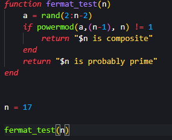
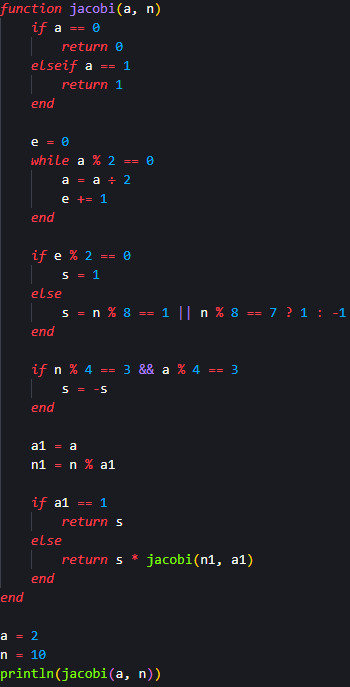
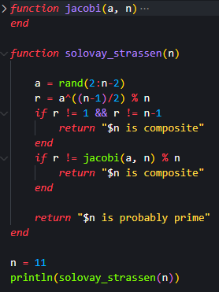
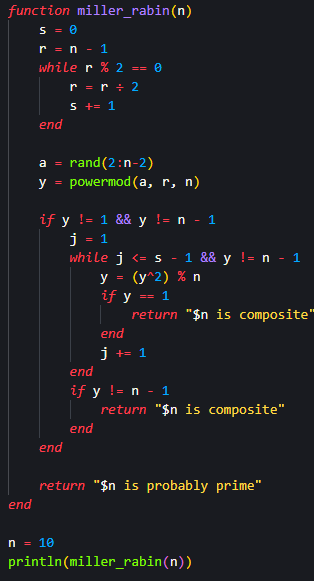

## Цель работы

Реализовать алгоритмы вероятностной проверки чисел на простоту.

## Задания

- Реализовать алгоритм теста Ферма;

- Реализовать алгоритм вычисления символа Якоби;

- Реализовать алгоритм теста Соловэя-Штрассена;

- Реализовать алгоритм теста Миллера-Рабина.

## Алгоритм теста Ферма - код

{#fig:001}

## Алгоритм теста Ферма - результат выполнения

{#fig:002}

## Алгоритм вычисления символа Якоби - код

{#fig:003 width=35%}

## Алгоритм вычисления символа Якоби - результат выполнения

{#fig:004}

## Алгоритм теста Соловэя-Штрассена - код

{#fig:005 width=50%}

## Алгоритм теста Соловэя-Штрассена - результат выполнения

{#fig:006}

## Алгоритм теста Миллера-Рабина - код

{#fig:007 width=35%}

## Алгоритм теста Миллера-Рабина - результат выполнения

{#fig:008}

## Вывод

Я реализовал алгоритмы вероятностной проверки чисел на простоту.

# Спасибо за внимание