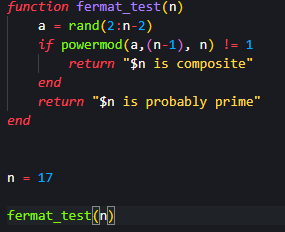
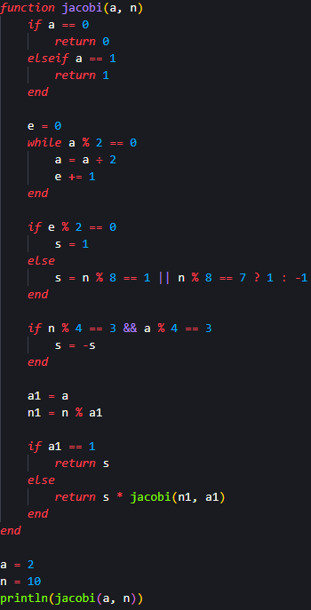
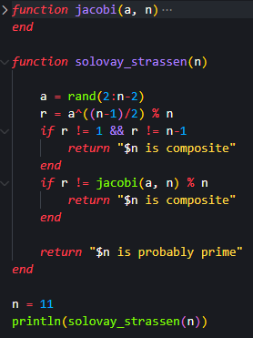
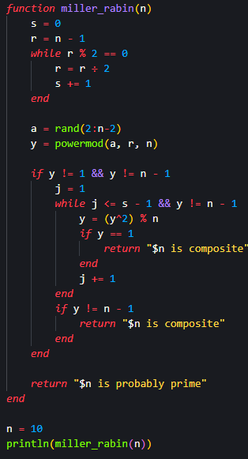

---
## Front matter
title: "Лабораторна работа № 6"
subtitle: "Вероятностные проверки чисел на простоту"
author: "Покрас Илья Михайлович"

## Generic otions
lang: ru-RU
toc-title: "Содержание"

## Bibliography
bibliography: bib/cite.bib
csl: pandoc/csl/gost-r-7-0-5-2008-numeric.csl

## Pdf output format
toc: true # Table of contents
toc-depth: 2
lof: true # List of figures
lot: false # List of tables
fontsize: 12pt
linestretch: 1.5
papersize: a4
documentclass: scrreprt
## I18n polyglossia
polyglossia-lang:
  name: russian
  options:
	- spelling=modern
	- babelshorthands=true
polyglossia-otherlangs:
  name: english
## I18n babel
babel-lang: russian
babel-otherlangs: english
## Fonts
mainfont: IBM Plex Serif
romanfont: IBM Plex Serif
sansfont: IBM Plex Sans
monofont: IBM Plex Mono
mathfont: STIX Two Math
mainfontoptions: Ligatures=Common,Ligatures=TeX,Scale=0.94
romanfontoptions: Ligatures=Common,Ligatures=TeX,Scale=0.94
sansfontoptions: Ligatures=Common,Ligatures=TeX,Scale=MatchLowercase,Scale=0.94
monofontoptions: Scale=MatchLowercase,Scale=0.94,FakeStretch=0.9
mathfontoptions:
## Biblatex
biblatex: true
biblio-style: "gost-numeric"
biblatexoptions:
  - parentracker=true
  - backend=biber
  - hyperref=auto
  - language=auto
  - autolang=other*
  - citestyle=gost-numeric
## Pandoc-crossref LaTeX customization
figureTitle: "Рис."
lofTitle: "Список иллюстраций"
## Misc options
indent: true
header-includes:
  - \usepackage{indentfirst}
  - \usepackage{float} # keep figures where there are in the text
  - \floatplacement{figure}{H} # keep figures where there are in the text
---

# Цель работы

Реализовать алгоритмы вероятностной проверки чисел на простоту.

# Задание

- Реализовать алгоритм теста Ферма;

- Реализовать алгоритм вычисления символа Якоби;

- Реализовать алгоритм теста Соловэя-Штрассена;

- Реализовать алгоритм теста Миллера-Рабина.

# Теоретическое введение

Тест простоты Ферма в теории чисел — это тест простоты натурального числа n, основанный на малой теореме Ферма. Малая теорема Ферма - теорема теории чисел, которая утверждает, что: если p - простое число и а - целое число, не делящееся на p, то a^(p-1) - 1 делится на p

Символ Якоби — теоретико-числовая функция двух аргументов, введённая К. Якоби в 1837 году. Символ Якоби обобщает символ Лежандра на все нечётные числа, большие единицы. Символ Кронекера — Якоби, в свою очередь, обобщает символ Якоби на все целые числа, но в практических задачах символ Якоби играет гораздо более важную роль, чем символ Кронекера — Якоби.

Тест Соловея — Штрассена — вероятностный тест простоты, открытый в 1970-х годах Робертом Мартином Соловеем совместно с Фолькером Штрассеном. Тест всегда корректно определяет, что простое число является простым, но для составных чисел с некоторой вероятностью он может дать неверный ответ. Основное преимущество теста заключается в том, что он, в отличие от теста Ферма, распознает числа Кармайкла как составные.

Тест Миллера — Рабина — вероятностный полиномиальный тест простоты. Тест Миллера — Рабина, наряду с тестом Ферма и тестом Соловея — Штрассена, позволяет эффективно определить, является ли данное число составным. Однако, с его помощью нельзя строго доказать простоту числа. Тем не менее тест Миллера — Рабина часто используется в криптографии для получения больших случайных простых чисел.

# Выполнение лабораторной работы

## Алгоритм теста Ферма

Я создал функцию алгоритма теста Ферма для проверки числа на простоту с входными данными в виде числа и с выводом сообщение о том, каким число является, в зависимости от того, выполненяется ли условие. Далее вызвал функцию, входным аргументом котороой будет являться переменная, которую я задал до этого (рис. [-@fig:001]).

{#fig:001}

И получил следующее сообщение  (рис. [-@fig:002]):

{#fig:002}

## Алгоритм вычисления символа Якоби

Далее я создал функцию алгоритма вычисления символа Якоби для работы которого требуются входные параметры а и n, такие, что n >= 3, 0 <= а < n. Далее я задал переменные, которые будут являться этими входными данными и используя их вызвал функцию (рис. [-@fig:003]).

{#fig:003}

И получил следующий результат  (рис. [-@fig:004]):

{#fig:004}

## Алгоритм теста Соловэя-Штрассена

После я создал функцию алгоритма теста Соловэя-Штрассена, который так же вызывает функцию вычисления символа Якоби, который был реализован ранее. Будет выводиться сообщение о том, каким число является, в зависимости от того, выполненяется ли условие. Далее вызвал функцию, входным аргументом котороой будет являться переменная, которую я задал до этого (рис. [-@fig:005]).

{#fig:005}

И получил следующий результат  (рис. [-@fig:006]):

{#fig:006}

## Алгоритм теста Миллера-Рабина

Я создал функцию алгоритма теста Миллера-Рабина, требующую число n >= 5, которое провряется на простоту. Будет выводиться сообщение о том, каким число является, в зависимости от того, выполненяется ли условие. Далее я создал переменную, которая будет являться входным параметром вызываемой функции  (рис. [-@fig:007]):

{#fig:007}

И получил следующий результат  (рис. [-@fig:008]):

{#fig:008}

# Выводы

Я реализовал алгоритмы вероятностной проверки чисел на простоту.

# Список Литературы{.unnumbered}

1. [Julia - Control Flow](https://docs.julialang.org/en/v1/manual/control-flow/)
2. [Julia - Mathematical Operations](https://docs.julialang.org/en/v1/manual/mathematical-operations/)
3. [Alfred J. Menezes, Paul C. van Oorschot and Scott A. Vanstone - Handbook of Applied Cryptography](https://cacr.uwaterloo.ca/hac/)