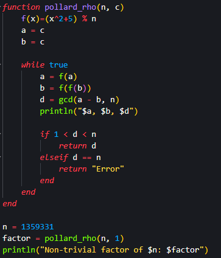
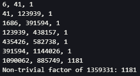

## Цель работы

Реализовать алгоритм разложения чисел на множители.

## Задания

Реализовать алгоритм, реализующий $\rho$-метод Полларда.

## $\rho$-метод Полларда - код

{#fig:001 width=50%}

## $\rho$-метод Полларда - результат

{#fig:002}

## Вывод

Я реализовал алгоритм реализующий $\rho$-метод Полларда.

# Спасибо за внимание