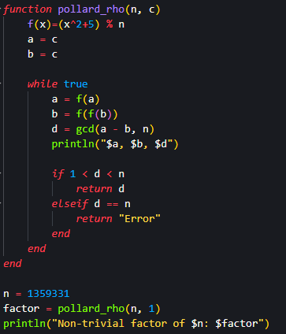
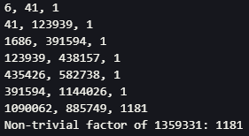

---
## Front matter
title: "Лабораторна работа № 6"
subtitle: "Разложение чисел на множители"
author: "Покрас Илья Михайлович"

## Generic otions
lang: ru-RU
toc-title: "Содержание"

## Bibliography
bibliography: bib/cite.bib
csl: pandoc/csl/gost-r-7-0-5-2008-numeric.csl

## Pdf output format
toc: true # Table of contents
toc-depth: 2
lof: true # List of figures
lot: false # List of tables
fontsize: 12pt
linestretch: 1.5
papersize: a4
documentclass: scrreprt
## I18n polyglossia
polyglossia-lang:
  name: russian
  options:
	- spelling=modern
	- babelshorthands=true
polyglossia-otherlangs:
  name: english
## I18n babel
babel-lang: russian
babel-otherlangs: english
## Fonts
mainfont: IBM Plex Serif
romanfont: IBM Plex Serif
sansfont: IBM Plex Sans
monofont: IBM Plex Mono
mathfont: STIX Two Math
mainfontoptions: Ligatures=Common,Ligatures=TeX,Scale=0.94
romanfontoptions: Ligatures=Common,Ligatures=TeX,Scale=0.94
sansfontoptions: Ligatures=Common,Ligatures=TeX,Scale=MatchLowercase,Scale=0.94
monofontoptions: Scale=MatchLowercase,Scale=0.94,FakeStretch=0.9
mathfontoptions:
## Biblatex
biblatex: true
biblio-style: "gost-numeric"
biblatexoptions:
  - parentracker=true
  - backend=biber
  - hyperref=auto
  - language=auto
  - autolang=other*
  - citestyle=gost-numeric
## Pandoc-crossref LaTeX customization
figureTitle: "Рис."
lofTitle: "Список иллюстраций"
## Misc options
indent: true
header-includes:
  - \usepackage{indentfirst}
  - \usepackage{float} # keep figures where there are in the text
  - \floatplacement{figure}{H} # keep figures where there are in the text
---

# Цель работы

Реализовать алгоритм разложения чисел на множители.

# Задание

Реализовать алгоритм, реализующий $\rho$-метод Полларда.

# Теоретическое введение

$\rho$-алгоритм Полларда — предложенный Джоном Поллардом в 1975 году алгоритм, служащий для факторизации (разложения на множители) целых чисел. $\rho$-алгоритм  строит числовую последовательность, элементы которой образуют цикл, начиная с некоторого номера n, что может быть проиллюстрировано, расположением чисел в виде греческой буквы ρ, что послужило названием семейству алгоритмов

# Выполнение лабораторной работы

Я создал функцию алгоритма, реализующего $\rho$-метод Полларда, принимающий число для разложения n и начальное значение c. Далее я задал число для разложения множителей, вызвал функцию и вывел полученные данные (рис. [-@fig:001]).

{#fig:001}

И получил следующий результат (рис. [-@fig:002]).

{#fig:002}

Здесь выведены значения a, b и n на каждой итерации и финальный резльутат.

# Выводы

Я реализовал алгоритм реализующий $\rho$-метод Полларда.

# Список Литературы{.unnumbered}

1. [Julia - Control Flow](https://docs.julialang.org/en/v1/manual/control-flow/)
2. [Julia - Mathematical Operations](https://docs.julialang.org/en/v1/manual/mathematical-operations/)
3. [Alfred J. Menezes, Paul C. van Oorschot and Scott A. Vanstone - Handbook of Applied Cryptography](https://cacr.uwaterloo.ca/hac/)