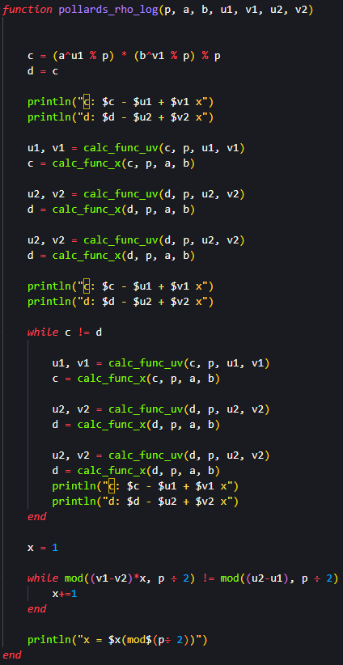
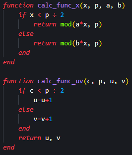
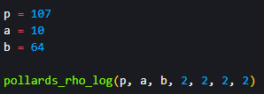
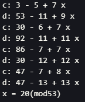

## Цель работы

Реализовать алгоритм дискретного логарифмирования программно

## Задания

Реализовать $\rho$-метод Полларда для задач дискретного логарифмирования.

## $\rho$-метод Полларда - основная функция

{#fig:001 width=30%}

## $\rho$-метод Полларда - функции расчета

{#fig:002 width=55%}

## $\rho$-метод Полларда - переменные и вызов функции

{#fig:003}

## $\rho$-метод Полларда - результат

{#fig:004}

## Вывод

Я реализовал $\rho$-метод Полларда для задач дискретного логарифмирования.

# Спасибо за внимание