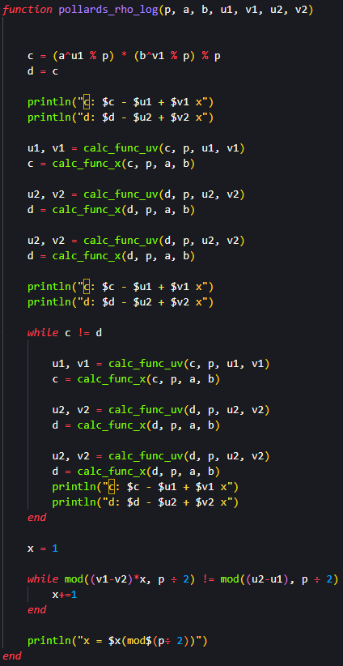
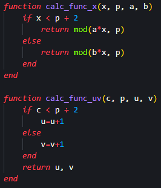
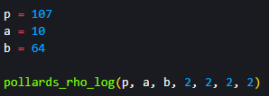
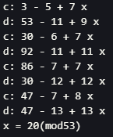

---
## Front matter
title: "Лабораторна работа № 7"
subtitle: "Дисректное логарифмирование в конечном поле"
author: "Покрас Илья Михайлович"

## Generic otions
lang: ru-RU
toc-title: "Содержание"

## Bibliography
bibliography: bib/cite.bib
csl: pandoc/csl/gost-r-7-0-5-2008-numeric.csl

## Pdf output format
toc: true # Table of contents
toc-depth: 2
lof: true # List of figures
lot: false # List of tables
fontsize: 12pt
linestretch: 1.5
papersize: a4
documentclass: scrreprt
## I18n polyglossia
polyglossia-lang:
  name: russian
  options:
	- spelling=modern
	- babelshorthands=true
polyglossia-otherlangs:
  name: english
## I18n babel
babel-lang: russian
babel-otherlangs: english
## Fonts
mainfont: IBM Plex Serif
romanfont: IBM Plex Serif
sansfont: IBM Plex Sans
monofont: IBM Plex Mono
mathfont: STIX Two Math
mainfontoptions: Ligatures=Common,Ligatures=TeX,Scale=0.94
romanfontoptions: Ligatures=Common,Ligatures=TeX,Scale=0.94
sansfontoptions: Ligatures=Common,Ligatures=TeX,Scale=MatchLowercase,Scale=0.94
monofontoptions: Scale=MatchLowercase,Scale=0.94,FakeStretch=0.9
mathfontoptions:
## Biblatex
biblatex: true
biblio-style: "gost-numeric"
biblatexoptions:
  - parentracker=true
  - backend=biber
  - hyperref=auto
  - language=auto
  - autolang=other*
  - citestyle=gost-numeric
## Pandoc-crossref LaTeX customization
figureTitle: "Рис."
lofTitle: "Список иллюстраций"
## Misc options
indent: true
header-includes:
  - \usepackage{indentfirst}
  - \usepackage{float} # keep figures where there are in the text
  - \floatplacement{figure}{H} # keep figures where there are in the text
---

# Цель работы

Реализовать алгоритм дискретного логарифмирования программно

# Задание

Реализовать $\rho$-метод Полларда для задач дискретного логарифмирования.

# Теоретическое введение

$\rho$-Метод Полларда для дискретного логарифмирования — алгоритм дискретного логарифмирования в кольце вычетов по простому модулю, имеющий экспоненциальную сложность. Предложен британским математиком Джоном Поллардом в 1978 году, основные идеи алгоритма очень похожи на идеи $\rho$-алгоритма Полларда для факторизации чисел. Данный метод рассматривается для группы ненулевых вычетов по модулю p.

Постановка задачи:

Для заданного простого числа  p и двух целых чисел a и b требуется найти целое число x удовлетворяющее сравнению: $a^x≡b(mod p)$

# Выполнение лабораторной работы

Я создал функцию $\rho$-метод Полларда с входными параметрами a, b, p, v1, v2, u1, u2 (u, v могут быть как определнными числами, так и случайными значениями). Данная функция рассчитывает c и d, а так же их логарифмы. Далее вычисляется x, удовлетворяющее условия сравнения, что и является результатом (рис. [-@fig:001]).

{#fig:001}

Мною были созданы функции для расчета функции c и d, а также u и v в зависимости от того, к какому множеству относится проверяемое значение (рис. [-@fig:002]).

{#fig:002}

Далее были инциализированы переменные и вызвана функция с данными, взятыми из примера для большей наглядности (рис. [-@fig:003]).

{#fig:003}

И получил следующие значения (рис. [-@fig:004]):

{#fig:004}

# Выводы

Я реализовал $\rho$-метод Полларда для задач дискретного логарифмирования.

# Список Литературы{.unnumbered}

1. [Julia - Control Flow](https://docs.julialang.org/en/v1/manual/control-flow/)
2. [Julia - Mathematical Operations](https://docs.julialang.org/en/v1/manual/mathematical-operations/)
3. [Alfred J. Menezes, Paul C. van Oorschot and Scott A. Vanstone - Handbook of Applied Cryptography](https://cacr.uwaterloo.ca/hac/)
