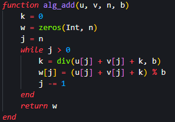
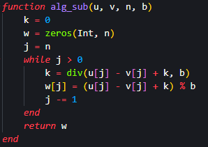
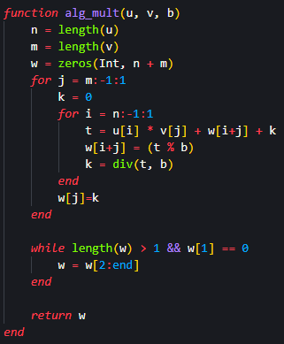
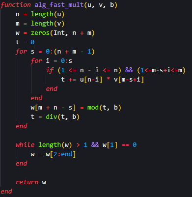
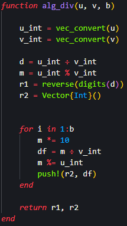
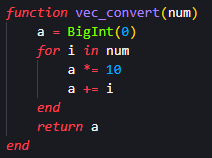
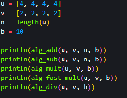
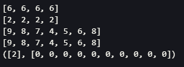

## Цель работы

Реализовать алгоритмы целочисленной арифметики многократной точности

## Задания

- Реализовать алгоритм сложения неотрицательных чисел

- Реализовать алгоритм вычитания неотрицательных чисел

- Реализовать алгоритм умножения неотрицательных чисел

- Реализовать алгоритм "быстрый столбик"

- Реализовать алгоритм деления многоразрядных целых чисел

## Алгоритм сложения неотрицательных чисел

{#fig:001}

## Алгоритм вычитания неотрицательных чисел

{#fig:002}

## Алгоритм умножения неотрицательных чисел

{#fig:003 width=50%}

## Алгоритм "быстрый столбик"

{#fig:004 width=50%}

## Алгоритм деления многоразрядных целых чисел - основной блок

{#fig:005 width=30%}

## Алгоритм деления многоразрядных целых чисел - функция конвертации

{#fig:006}

## Инициализация переменных и вызов функции

{#fig:007}

## Результат

{#fig:008}

## Вывод

Я реализовал алгоритмы целочисленной арифметики многократной точности.

# Спасибо за внимание