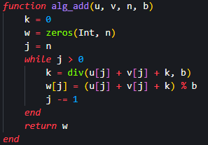
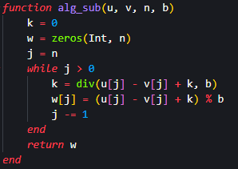
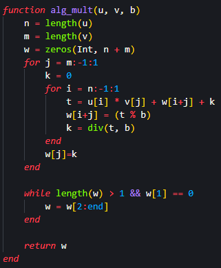
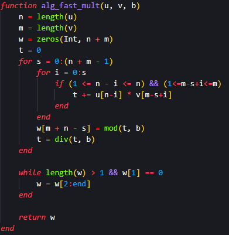
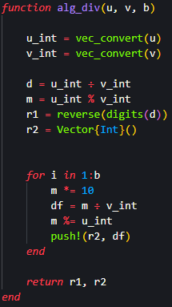
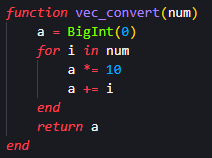
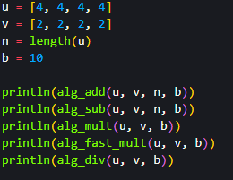
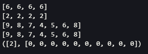

---
## Front matter
title: "Лабораторна работа № 8"
subtitle: "Целочисленная арифметика многократной точности"
author: "Покрас Илья Михайлович"

## Generic otions
lang: ru-RU
toc-title: "Содержание"

## Bibliography
bibliography: bib/cite.bib
csl: pandoc/csl/gost-r-7-0-5-2008-numeric.csl

## Pdf output format
toc: true # Table of contents
toc-depth: 2
lof: true # List of figures
lot: false # List of tables
fontsize: 12pt
linestretch: 1.5
papersize: a4
documentclass: scrreprt
## I18n polyglossia
polyglossia-lang:
  name: russian
  options:
	- spelling=modern
	- babelshorthands=true
polyglossia-otherlangs:
  name: english
## I18n babel
babel-lang: russian
babel-otherlangs: english
## Fonts
mainfont: IBM Plex Serif
romanfont: IBM Plex Serif
sansfont: IBM Plex Sans
monofont: IBM Plex Mono
mathfont: STIX Two Math
mainfontoptions: Ligatures=Common,Ligatures=TeX,Scale=0.94
romanfontoptions: Ligatures=Common,Ligatures=TeX,Scale=0.94
sansfontoptions: Ligatures=Common,Ligatures=TeX,Scale=MatchLowercase,Scale=0.94
monofontoptions: Scale=MatchLowercase,Scale=0.94,FakeStretch=0.9
mathfontoptions:
## Biblatex
biblatex: true
biblio-style: "gost-numeric"
biblatexoptions:
  - parentracker=true
  - backend=biber
  - hyperref=auto
  - language=auto
  - autolang=other*
  - citestyle=gost-numeric
## Pandoc-crossref LaTeX customization
figureTitle: "Рис."
lofTitle: "Список иллюстраций"
## Misc options
indent: true
header-includes:
  - \usepackage{indentfirst}
  - \usepackage{float} # keep figures where there are in the text
  - \floatplacement{figure}{H} # keep figures where there are in the text
---

# Цель работы

Реализовать алгоритмы целочисленной арифметики многократной точности

# Задание

- Реализовать алгоритм сложения неотрицательных чисел

- Реализовать алгоритм вычитания неотрицательных чисел

- Реализовать алгоритм умножения неотрицательных чисел

- Реализовать алгоритм "быстрый столбик"

- Реализовать алгоритм деления многоразрядных целых чисел

# Теоретическое введение

- Алгоритм сложения неотрицательных чисел заключается в пошаговом суммировании цифр чисел, начиная с младших разрядов и перенося разряды при необходимости. Этот алгоритм позволяет эффективно выполнять операцию сложения.

- Алгоритм вычитания неотрицательных чисел включает поэтапное вычитание цифр чисел, начиная с младших разрядов и заемом разрядов, если необходимо. Он обеспечивает эффективное выполнение операции вычитания.

- Алгоритм умножения неотрицательных чисел базируется на методе пошагового умножения цифр чисел и последующем сложении результатов. Он предоставляет эффективный способ выполнения операции умножения.

- Алгоритм "быстрый столбик" представляет собой метод многоразрядного умножения чисел с использованием оптимизаций. Этот алгоритм значительно ускоряет выполнение операции умножения.

- Алгоритм деления многоразрядных целых чисел основывается на методе пошагового нахождения частного и остатка при делении чисел. Он позволяет эффективно и точно выполнять операцию деления.

# Выполнение лабораторной работы

## Алгоритм сложения неотрицательных чисел

Я реализовал функцию алгоритма сложения неотрицательных чисел. Она принимает два массива цифр u и v, их длину n и основание системы счисления b, складывает числа, представленные массивами u и v, с учетом переносов и возвращает результат в виде нового массива цифр w. (рис. [-@fig:001]).

{#fig:001}

## Алгоритм вычитания неотрицательных чисел

Я реализовал функцию алгоритма вычитания неотрицательных чисел, принцип которого схож с алгоритмом сложения - она также принимает два массива цифр u и v, их длину n и основание системы счисления b. Она вычитает число, представленное массивом v, из числа, представленного массивом u, с учетом переносов и возвращает результат в виде нового массива цифр w (рис. [-@fig:002]).

{#fig:002}

## Алгоритм умножения неотрицательных чисел

Далее я реализовал функцию умножения неотрицательных чисел реализует умножение u и v с основанием системы счисления b. В циклах происходит умножение коэффициентов, вычисление остатка от деления и переноса, а также добавление переноса к более старшему разряду. После умножения удаляются ведущие нули и возвращается результат(рис. [-@fig:003]).

{#fig:003}

## Алгоритм "быстрый столбик"

Реализованная мной функция алгоритма "быстрый столбик" также умножает u и v с основанием системы счисления b, но использует более оптимизированный подход. Она выполняет те же операции, но использует вложенные циклы для суммирования произведений коэффициентов во время умножения. Результат также корректируется и возвращается после удаления ведущих нулей (рис. [-@fig:004]).

{#fig:004}

## Алгоритм деления многоразрядных целых чисел

Мною реализованная функция деления многоразрядных целых чисел принимает три параметра: два массива чисел u и v и число b. Внутри функции vec_convert используется для конвертации массивов чисел u и v в целочисленные значения. Затем в функции alg_div происходит деление u на v в b-ичной системе счисления. Деление выполняется сначала с помощью оператора ÷, затем находится остаток от деления с помощью оператора %. Далее результат деления d раскладывается на цифры и сохраняется в массив r1, а затем выполняются b итераций, при которых остаток m умножается на 10, далее находится целая часть от деления и добавляется в массив r2. В конце функция возвращает массивы r1 и r2 (рис. [-@fig:005]).

{#fig:005}

Также Для данного алгоритма была реализована функция конвертации массива в переменную типа BigInt (рис. [-@fig:006]).

{#fig:006}

## Инициализация переменных и вызов функции

Далее я инициализировал переменные, которые будут входными параметрами вызванных далее функций (рис. [-@fig:007]).

{#fig:007}

И получил следующей результат (рис. [-@fig:008]).

{#fig:008}

# Выводы

Я реализовал алгоритмы целочисленной арифметики многократной точности

# Список Литературы{.unnumbered}

1. [Julia - Control Flow](https://docs.julialang.org/en/v1/manual/control-flow/)
2. [Julia - Mathematical Operations](https://docs.julialang.org/en/v1/manual/mathematical-operations/)
3. [Alfred J. Menezes, Paul C. van Oorschot and Scott A. Vanstone - Handbook of Applied Cryptography](https://cacr.uwaterloo.ca/hac/)
